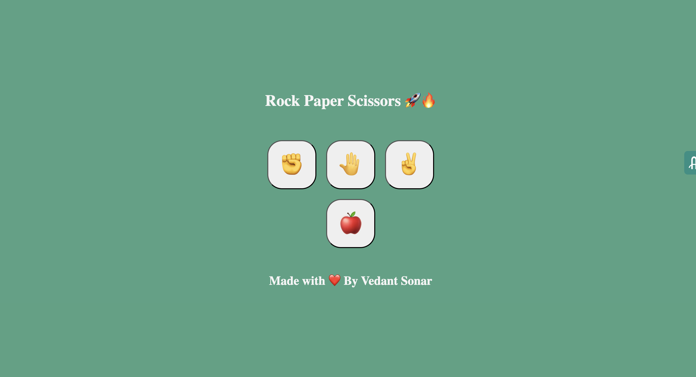

<h1>Stone Paper Scissors Game 🎮</h1>

Welcome to the Stone Paper Scissors Game! 🪨📄✂️
This project is a fun and interactive implementation of the classic hand game, built entirely with JavaScript, HTML, and CSS. It showcases a simple yet engaging user interface and leverages core programming concepts such as event handling, conditional logic, and DOM manipulation.

<h2 id="overview">Features 🚀</h2>

-Player vs. Computer Gameplay: Play against a computer opponent that randomly selects its moves.
-Real-Time Feedback: Visual and textual updates after each round, showing the winner or a tie.
-Score Tracker: Keeps track of your wins, losses, and ties.
-Responsive Design: Works seamlessly on desktops and mobile devices.

<h2 id="overview">Purpose 💡</h2>

This project serves as a beginner-friendly example of:

-Building an interactive web application.
-Utilizing JavaScript for game logic.
-Implementing dynamic updates in the browser with the DOM API.
-Whether you're learning JavaScript or just looking for a nostalgic gaming experience, this project is for you! Feel free to fork, experiment, and enhance it as you like.

